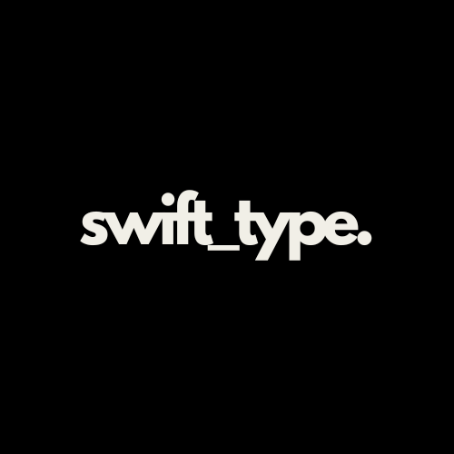

# swift_type.

A minimalist 15-second typing test website built with vanilla HTML, CSS, and JavaScript.

## Version
v1.0.0 (Works best on a desktop)

## Features

- **15-Second Typing Test**: Quick and efficient way to measure typing speed
- **Real-time Statistics**: 
  - Words Per Minute (WPM)
  - Accuracy Percentage
- **Dynamic Keyboard Visualization**:
  - Real-time key highlighting
  - Three keyboard styles:
    - Round (default)
    - Square
    - Bordered
- **Smooth Text Display**:
  - Three-line text display
  - Automatic text progression
  - Smooth fade transitions
  - Cursor tracking
- **Error Handling**:
  - Real-time error highlighting
  - Backspace support
  - Accuracy calculation

## Technologies Used

- HTML5
- CSS3
- Vanilla JavaScript
- Google Fonts:
  - League Spartan
  - Roboto

## Usage

1. Open the website in a browser
2. Press any key to start typing
3. The timer will automatically start on first keystroke
4. Type the displayed text as accurately as possible
5. View your WPM and accuracy results after 15 seconds
6. Press TAB to restart the test

## Keyboard Customization

Toggle between three keyboard styles using the buttons in the top-right corner:
- Round: Circular keys (default)
- Square: Square keys with rounded corners
- Bordered: Outlined keys with transparent background

## Design Features

- Minimalist black and white design
- Smooth animations and transitions
- Responsive layout
- Custom cursor animation
- Dynamic text fading
- Clean result display

## Installation

1. Clone the repository
2. Place files in your web server directory
3. Ensure all files are in the following structure: 
